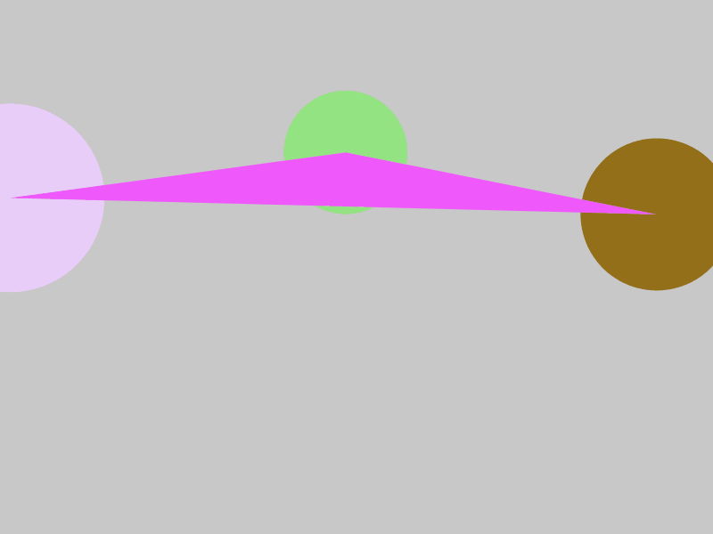

# Triángulos Sonoros

## Introducción

En esta práctica hemos combinado la salida de video que se muestra por pantalla con una salida de audio que depende enteramente de como se comporta la salida visual. La parte visual está cubierta con las primitivas 2D básicas que nos proporciona Processing, mientras que la auditiva requiere de la librería *sound* y de la clase *Oscillator* que esta incluye.

## Desarrollo

La aplicación carece de interacción real con el usuario y pretende ser una experiencia contemplativa. El programa posee un alto componente de aleatoriedad y se encuentra dividido en intervalos temporales. Estos ciclos de tiempo a su vez poseen una duración aleatoria que va desde medio segundo hasta tres. En ese tiempo se muestra en pantalla un triángulo en el que en cada uno de sus vértices hay un círculo y se reproduce un sonido dependiente de la combinación de estas formas que se muestra.

### Formas

Las formas poseen también un alto grado de aleatoriedad. En cada intervalo temporal se generan unas coordenadas aleatorias para cada uno de los círculos, que al mismo tiempo marcan los vértices del triángulo que une a las circunferencias. Estos tendrán también un color aleatorio, un tamaño inicial (que oscilará entre 100 y 440) y, además, cada uno tendrá asocida una variable de tipo boolean, generada con la función  *Random.nextBoolean()*, que determinará si durante el ciclo temporal en el que se muestran estas primitivas, el tamaño de la elipse se expande o, por el contrario, se encoge.

En lo que respecta al triángulo este también comenzará con una posición aleatoria (que viene proporcionada por las posiciones de los centros de las circunferencias), un color aleatorio y su propia variable de tipo *boolean* en la que también determinaremos si las posiciones de los círculos se aproximan al baricentro del mismo, creando de esta forma la sensación de que se encoge, o si por el contrario se alejan de él, haciendo que el triángulo se expanda.

### Sonido

El sonido que emitirá el programa se encuentra condicionado por la parte visual, y por tanto poseerá un alto grado de aleatoriedad. Se han incluido tres osciladores distitos: uno de sierra (*SawOsc*), uno triangular (*TriOsc*) y otro cuadrado (*SqrOsc*). Cada uno de ellos se encuentra asociado a uno de los tres círculos que se observan, al comienzo de cada intervalo se compararán los tamaños iniciales de los triángulos y se empleará en ese ciclo el oscilador que este asociado a aquel círculo que sea el mayor en el instante inicial.

Durante la ejecución del intervalo los tamaños de las figuras se modificarán y con ellos también lo harán la frecuencia y la amplitud del oscilador. La frecuencia irá asociada al área del triángulo, creciendo cuando esta lo haga y decreciendo en caso contrario. Por otro lado, la amplitud estará ligada a la media del tamaño de los círculos, creciendo cuando esta crezca y decreciendo cuando no sea así.

## Previsualización del Programa

La grabación del GIF redujo en gran medida la capacidad del ordenador para modificar los tamaños de las figuras en el ciclo temporal, por lo que en una ejecución normal del programa estas sufren modificaciones mucho más notables.

  

